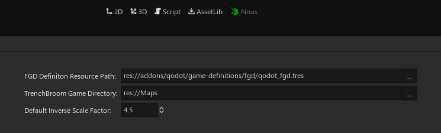
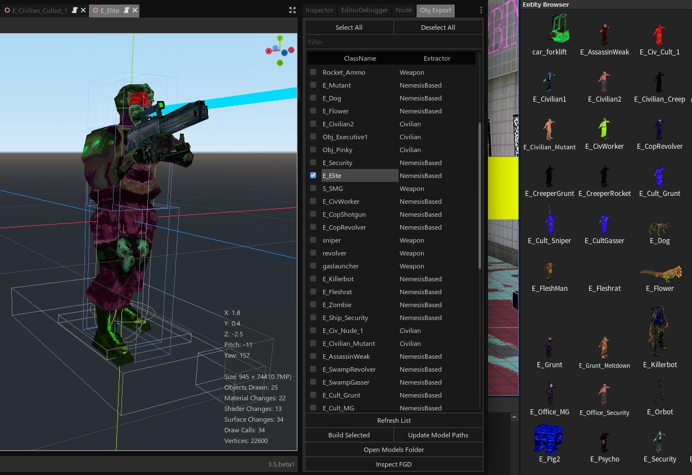
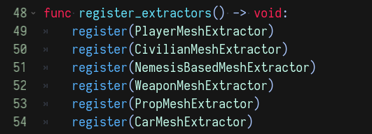

# Nous

Utility for TrenchBroom/Qodot based development in Godot—both plugin and target features in TrenchBroom and plugin very much WIP. 


## Install

Place `addons/nous` in your project's `addons` folder.

## Usage

### TrenchBroom Entity Model Export

Export an `.obj` file, and its used textures, into a configured TrenchBroom game directory for a given scene file. `.obj` files load textures in a TrenchBroom-friendly manner (`usemtl <game-dir-relative-texture-path>`). (Original use case is working on modding support in Cruelty Squad with only a decompiled project folder with no original models.)

`.obj` file generation based on [fractilegame's godot-obj-export script](https://github.com/fractilegames/godot-obj-export), with additional input mesh compatibility, texture linking, and significant performance improvement from reducing string conversions and replacing string concatenation with a single `PoolStringArray`.

#### Qodot / TrenchBroom

At the time of writing, the [pull request adding `.obj` model support](https://github.com/TrenchBroom/TrenchBroom/pull/3910) has still not been merged, but hopefully will soon—until its merged (or export to `.mdl` is implemented in this plugin), a build of that fork is required.

As for Qodot:
  - `obj` format must be added to the list of model formats in [trenchbroom_game_config_file.gd](https://github.com/QodotPlugin/qodot-plugin/blob/6f98fdb739abc5b25031a01582749be98d194bfe/addons/qodot/src/resources/game-definitions/trenchbroom/trenchbroom_game_config_file.gd#L43)
  - A case must be added for `Dictionary` meta-properties [`build_def_text`](https://github.com/QodotPlugin/qodot-plugin/blob/6f98fdb739abc5b25031a01582749be98d194bfe/addons/qodot/src/resources/game-definitions/fgd/qodot_fgd_class.gd#L70), e.g.:
  
````gdscript
		#...
		elif value is String:
			res += value
		elif value is Dictionary:
			res += to_json(value)

		res += ")"
		#...
````

#### Configuration



Nous' main panel can be used to configure .obj export—your project's FGD definitions resource file, TrenchBroom game directory, and inverse scale factor.

#### Export



After FGD definitions are properly configured, the Obj Export panel will populate a list of found point entities which can be selected for export. Double clicking on an entity's classname will open its scene file, middle click to reveal its fgd definition resource in the inspector. Similarly, model paths can be updated with the Update Model Paths button.

#### Mesh Extraction Rules

Entity scenes are matched with and passed to implementations of the base `EntityMeshExtractor` class in the export process. To add new extractors, create a new _named class_ extractor script in `src/extractors` that extends `EntityMeshExtractor` with required method implementations, and add its singleton to the `register` calls in `EntityMeshExtractors.register_extractors`, in order of priority:



See `src/extractors` folder for various implementations created for and used in Cruelty Squad mod development. A more streamlined interface for adding extractors is very much on the TODO list.
